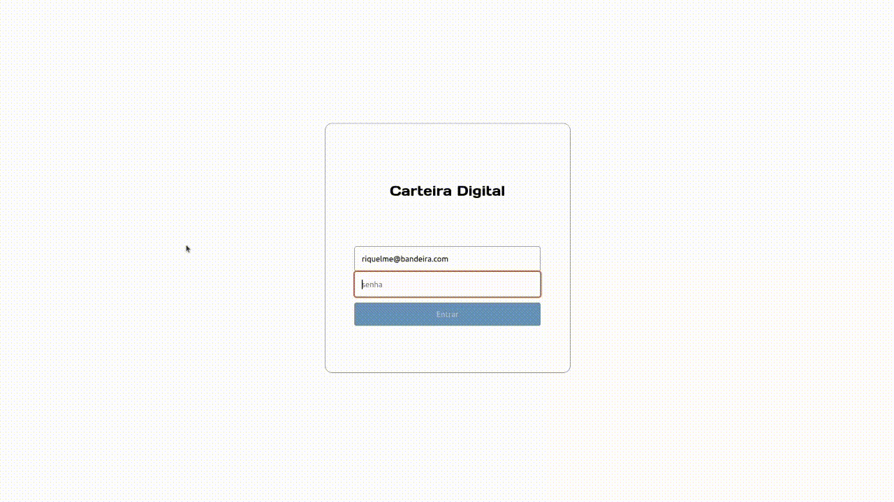

# Projeto Carteira Digital

# Contexto
Neste projeto foi desenvolvido uma carteira de controle de gastos com conversor de moedas, onde uma pessoa pode:

* Adicionar, remover e editar um gasto;
* Visualizar uma tabela com seus gastos;
* Visualizar o valor total gasto;

A conversão de valores é possível graças a API de cotações de moedas do **AwesomeAPI**, que abastece a aplicação.



## Tecnologias usadas

* React
* Redux
* CSS

## Instalando o projeto

1. Clone o repositório:

```
git clone git@github.com:riquelmebandeira/projeto-carteira-digital.git
```

2. Entre na pasta do repositório clonado:

```
cd projeto-carteira-digital
```

3. Instale as dependências com o comando:

```
npm install
```

## Executando a aplicação

  ```
  npm start
